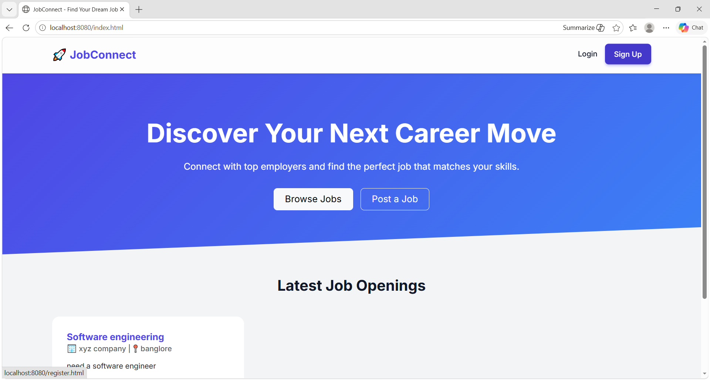
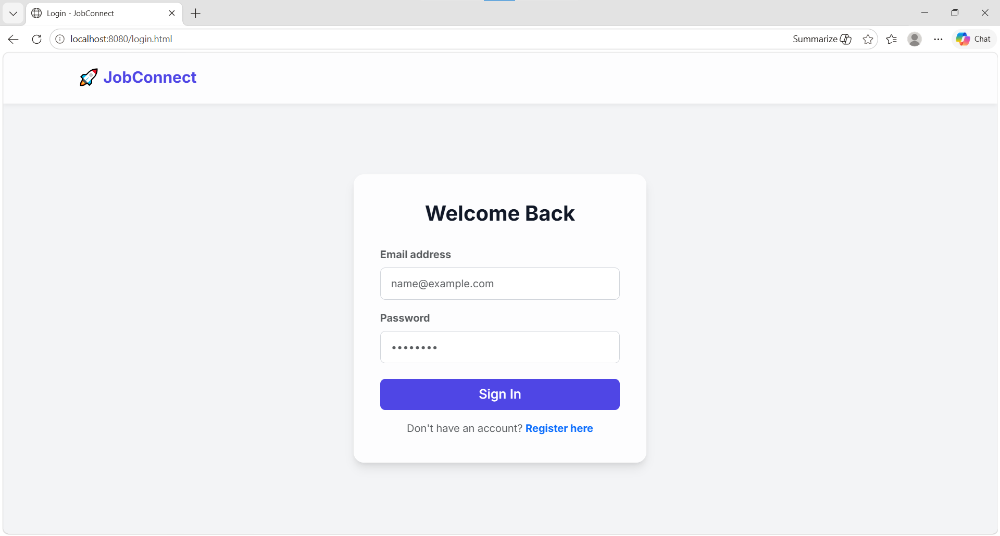
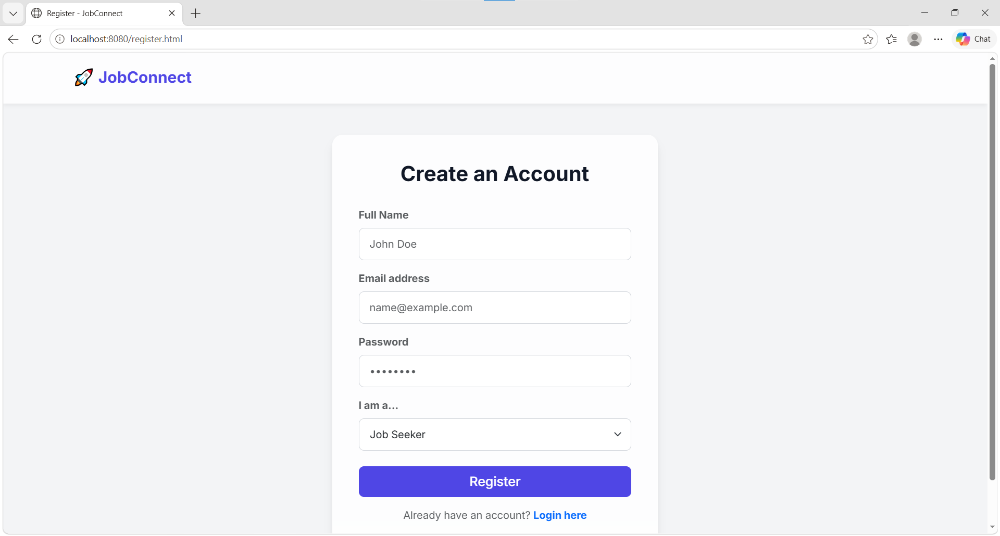
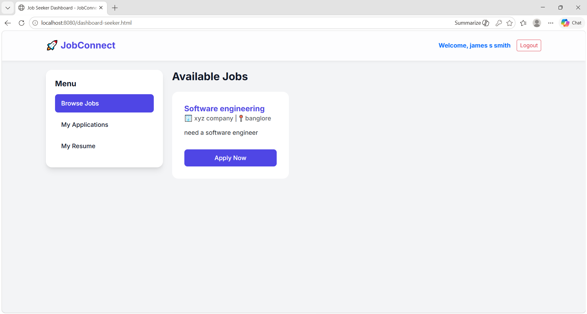
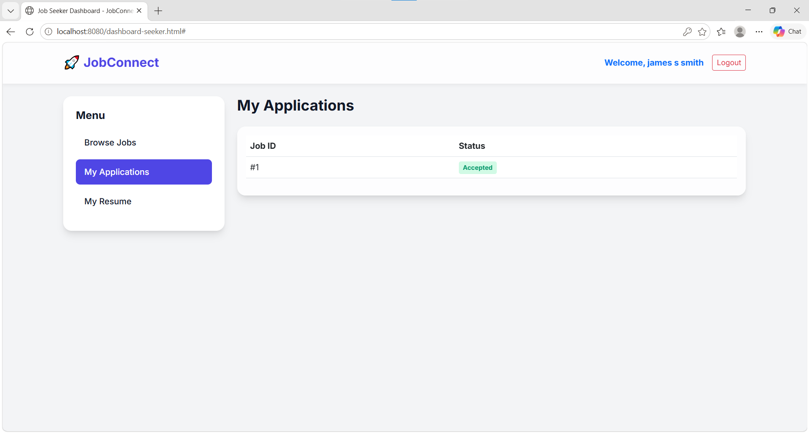
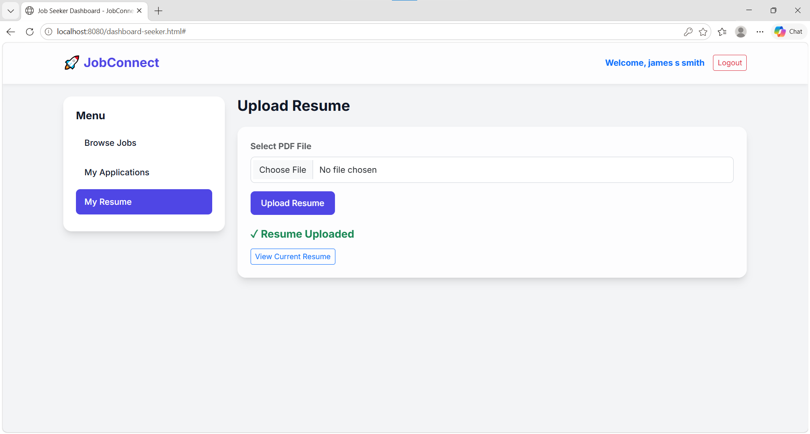
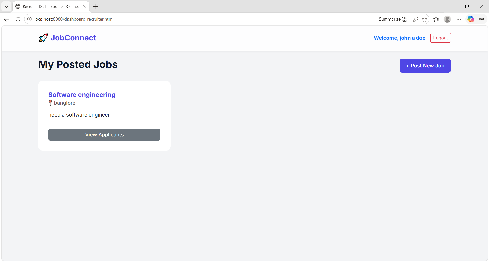
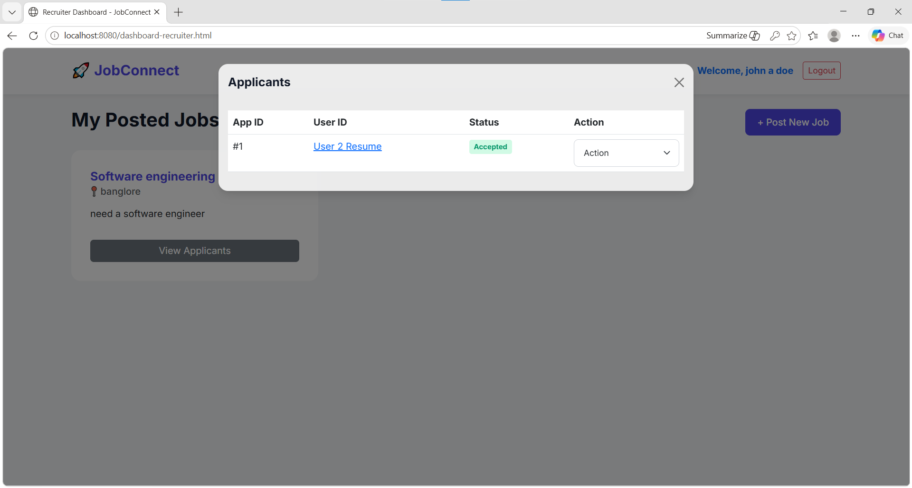

# JobConnect – Online Job Portal

A full-stack Online Job Portal web application developed using Java Spring Boot and MySQL that enables recruiters to post jobs and candidates to search and apply for opportunities through a responsive web interface.

---

## Features

### User Authentication
- User Registration
- Login and Logout
- Role-based access

### Job Seeker Module
- View job listings
- Search jobs
- Apply for jobs
- Resume upload

### Recruiter Module
- Post jobs
- Edit job details
- Delete jobs
- View applicants

### Admin Module
- Manage users
- Monitor jobs
- Remove invalid or spam job postings
- Dashboard overview

### Backend Features
- REST API integration
- CRUD operations
- MVC architecture
- Exception handling
- Database connectivity
- Responsive UI

---

## Tech Stack

### Frontend
- HTML5
- CSS3
- JavaScript
- Bootstrap 5

### Backend
- Java
- Spring Boot
- Spring MVC
- REST APIs

### Database
- MySQL
- JDBC / Spring Data JPA

### Testing and Tools
- JUnit
- Mockito
- Maven
- Git
- GitHub
- VS Code
- Postman

---

## Project Architecture

Frontend (HTML/CSS/JS/Bootstrap)
↓
REST API (Spring Boot)
↓
Service Layer
↓
Repository / JDBC
↓
MySQL Database

---

## Database Tables

### Users
- User ID
- Name
- Email
- Password
- Role

### Jobs
- Job ID
- Title
- Description
- Location
- Recruiter ID

### Applications
- Application ID
- User ID
- Job ID
- Status

---

## Screenshots

### Home Page


### Login Page


### Register Page


### Job Seeker Dashboard


### My Applications


### Resume Upload


### Recruiter Dashboard


### Applicant Management


---

## Setup Instructions

### Step 1 – Clone Repository

```bash
git clone https://github.com/yourusername/JobConnect.git
```

### Step 2 – Open Project

Open the project in VS Code or preferred IDE.

### Step 3 – Configure Database

Create MySQL database:

```sql
CREATE DATABASE jobportal;
```

Update database credentials inside:

```plaintext
src/main/resources/application.properties
```

Example:

```properties
spring.datasource.url=jdbc:mysql://localhost:3306/jobportal
spring.datasource.username=root
spring.datasource.password=yourpassword
```

### Step 4 – Run Application

Using Maven:

```bash
mvn spring-boot:run
```

Or run:

```plaintext
JobportalApplication.java
```

### Step 5 – Access Application

```plaintext
http://localhost:8080
```

---

## REST API Endpoints

### Authentication

```http
POST /api/auth/register
POST /api/auth/login
```

### Jobs

```http
GET /api/jobs
POST /api/jobs
PUT /api/jobs/{id}
DELETE /api/jobs/{id}
```

### Applications

```http
POST /api/apply
GET /api/applications
```

---

## Future Enhancements

- Email verification
- JWT authentication
- Advanced filtering
- Notifications
- Cloud deployment

---

## Author

**Bhumika Vishweshwar Pattar**

LinkedIn:
www.linkedin.com/in/bhumika-vp-27989930a

GitHub:
https://github.com/BhumikaVP